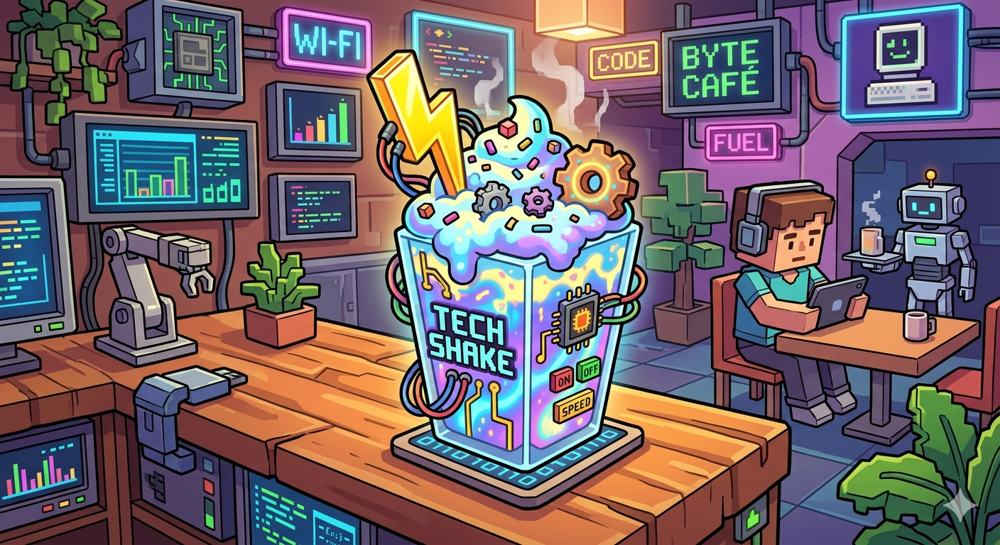

# milkshake-mafia

<p align="center">
  
</p>

The Taste Engine: a 3-tier pipeline that turns a URL into a virtual milkshake.

```
URL → Photographer → screenshot + embedding → Sommelier → Ingredients → Barista → 🥤
```

## Tiers

- **Photographer** (`src/photographer/`): Playwright capture + DINOv2/histogram embedder. Emits `EmbeddingArtifact` per `context/DATA_CONTRACTS.md §2`.
- **Sommelier** (`sommelier/`): pure-stdlib Python. PCA on the curated cellar, closed-vocab axis discovery, `Ingredients` JSON per `context/DATA_CONTRACTS.md §5`. See [`sommelier/README.md`](sommelier/README.md).
- **Barista** (`barista/`): React-Three-Fiber milkshake renderer. Consumes `Ingredients`. See [`barista/README.md`](barista/README.md).
- **Milkshake** (`milkshake/`): orchestrator that wires Photographer → Sommelier in one call. `python -m milkshake taste --url <URL>`.
- **Cellar** (`baselines/cellar_urls_v0.json`): 12 curated reference URLs (Gold / Gunk / Wasabi). Embeddings live alongside in `baselines/embeddings/`.

## Run end-to-end

**Easiest (full stack, one command):**

```bash
./scripts/dev.sh
```

First run bootstraps everything (creates `.venv`, installs Python deps incl.
torch + transformers, downloads Playwright Chromium, builds the cellar
baseline, installs `barista/node_modules`). Subsequent runs skip straight
to launch. Ctrl+C stops both servers.

Then open the Vite URL it prints (default `http://localhost:5173/`,
hops if 5173 is taken). The URL/Upload bar in the top-right calls the
local FastAPI bridge at `http://localhost:8000` by default — no extra
config needed when running both on the same machine.

**To point the frontend at a different backend** (e.g., a teammate's
machine via ngrok, or a deploy):

```bash
cp barista/.env.example barista/.env.local
# edit barista/.env.local — set VITE_TASTE_API_URL
./scripts/dev.sh
```

**CLI-only paths (no Barista UI):**

```bash
python -m milkshake taste --url https://stripe.com   # → Ingredients JSON
python scripts/smoke_taste_url.py                    # gold + gunk + failure
```

**Offline preset preview (no capture, no API call):**

```bash
python3 scripts/bake_barista_presets.py    # rebake from baseline embeddings
npm --prefix barista run dev                # http://localhost:5173
```

## Photographer (visual encoder tier)

Turns a URL into a `ScreenshotArtifact` (PNG + metadata) and an `EmbeddingArtifact`
(L2-normalized vector + metadata) per `context/DATA_CONTRACTS.md`. Capture and
vectorization only — no scoring, PCA, or rendering.

### Embedders

| `model_id`       | Dim | Backend                                     | When used                     |
| ---------------- | --- | ------------------------------------------- | ----------------------------- |
| `dinov2-base`    | 768 | `facebook/dinov2-base` via `transformers`   | **Default for the committed baseline.** Needs `pip install -e '.[dinov2]'` (torch + torchvision + transformers, ~500 MB; one-time HF model pull ~350 MB on first use). |
| `histogram-v0`   |  66 | numpy color histogram + Sobel edges + lum.  | Zero-install fallback; auto-used if DINOv2 import fails. To use as the canonical baseline, run `python -m photographer baseline build --embedder histogram` and re-bake. |

The fallback is recorded as a warning on the artifact and as a `model_id` change
on the baseline meta — Sommelier rejects mismatches, so always rebuild the
baseline after switching backends.

The orchestrator and the FastAPI service both auto-pick the embedder whose
`model_id` matches the committed baseline (via `embedder_for_baseline()`), so
you don't usually need to pass `--embedder` by hand — just rebuild the baseline
with the embedder you want as canonical and everything downstream follows.

### Capture defaults

| Setting       | Default                                      |
| ------------- | -------------------------------------------- |
| Viewport      | 1440×900                                     |
| `full_page`   | `true` (clipped to 6000 px tall, warned)     |
| `wait_until`  | `networkidle` (falls back to `domcontentloaded` on timeout, warned) |
| `wait_ms`     | 500                                          |
| User agent    | `Mozilla/5.0 (compatible; PhotographerBot/1.0)` |

### CLI

```bash
python -m photographer capture --url https://stripe.com --out artifacts/
python -m photographer embed   --image artifacts/<id>.png
python -m photographer run     --url https://stripe.com --out artifacts/
python -m photographer baseline build   # → baselines/embeddings/baseline_embeddings.jsonl + meta
```

`run` writes `<request_id>.png`, `<request_id>.screenshot.json`, and
`<request_id>.embedding.json` to `--out`.

### Baseline (Gold vs Gunk vs Wasabi)

The baseline is the curated cellar at `baselines/cellar_urls_v0.json`. Each URL
gets captured + embedded; output goes to `baselines/embeddings/`:

- `baseline_embeddings.jsonl` — one `{label,url,flavor_profile,why,embedding}` per
  line, drops straight into `TasteRequest.baseline.items`. The text fields are
  preserved so `sommelier/axes.py` can name discovered PCA axes.
- `baseline_meta.json` — `baseline_id`, `model_id`, `embedding_dim`,
  `normalized`, `created_at`, item count.

Rebuild whenever the embedder changes; Sommelier compares `embedding_dim` on
both sides and the orchestrator compares `model_id`.

### Smoke tests

```bash
python scripts/smoke_test.py                    # photographer-only
python scripts/smoke_taste_url.py               # end-to-end (photographer → sommelier)
```

### Failure modes (surfaced, not raised)

| Symptom                       | How it shows up                                          |
| ----------------------------- | -------------------------------------------------------- |
| `networkidle` hangs           | Warning + fallback to `domcontentloaded`                 |
| Navigation timeout still      | `error.type="timeout"`, no PNG, embedding zero-vector    |
| DNS / `net::ERR_*`            | `error.type="dns_error"`                                 |
| Page taller than 6000 px      | Image clipped, warning recorded                          |
| DINOv2 weights/torch missing  | Warning + automatic histogram fallback                   |

Sommelier's `ingredients_from_taste_request()` short-circuits on any
`target_embedding.error` and emits a `fish` / `expired_milk` `Ingredients`
fallback so the Barista renderer always gets a valid payload.

### Licensing notes

DINOv2 (`facebook/dinov2-base`) is released under Apache-2.0 — fine for
commercial use. The `histogram-v0` fallback is pure numpy, no model license.
Swapping to CLIP or another backend is a new `Embedder` class in
`src/photographer/embed.py` and a `load_embedder` arm.

## Branches

- `main` — context docs only
- `photographer` — capture + embedding tier in isolation
- `barista/scaffold` — original Barista scaffold
- `sommelier` — integration branch (this one): Sommelier + Photographer + orchestrator
