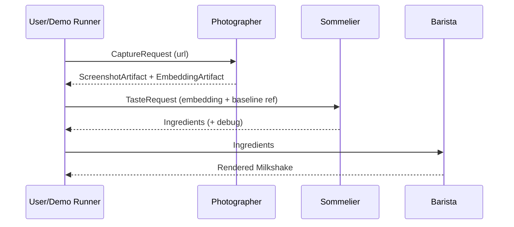

# Architecture (Taste Engine)

## The 3-tier pipeline

### Photographer (Visual Encoder)
**Input**: `CaptureRequest` (a URL + render settings)

**Output**:
- `ScreenshotArtifact` (PNG + metadata)
- `EmbeddingArtifact` (vector + metadata)

**Contract**: must produce embeddings that are:
- consistent shape (fixed dimensionality per model)
- repeatable enough across runs (deterministic settings as much as possible)
- accompanied by metadata (model id, viewport, timing, etc.)

---

### Sommelier (Logic & Mapping)
**Input**:
- `EmbeddingArtifact` for the target URL
- baseline dataset embeddings + labels (Gold/Gunk anchors)

**Output**:
- `Ingredients` (what the Barista renders)
- optional `SommelierDebug` (PCA components, projections, nearest neighbors)

**Contract**: should be:
- **relative** (computed in the same latent space as baseline)
- **explainable** enough to demo (“PC1 is viscosity because …”)

---

### Barista (Visualizer)
**Input**: `Ingredients`

**Output**: real-time visualization (web UI) that makes the taste result feel visceral:
- liquid color + gradient
- thickness / viscosity / flow
- inclusions/toppings
- animation triggered by new results

**Contract**:
- consumes Ingredients only (no PCA/embedding logic)
- renders fast (hackathon demo target: “feels instant”)

## Suggested integration patterns
Choose one, but keep the interfaces unchanged.

### Pattern A: Single orchestrator (fastest demo)
One process calls modules in sequence:
1) capture screenshot
2) compute embedding
3) map to ingredients
4) send to frontend via websocket or HTTP

### Pattern B: 3 local services (clean separation)
- Photographer service exposes `/capture` and `/embed`
- Sommelier service exposes `/taste`
- Barista is a web app that calls Sommelier (or an orchestrator)

## End-to-end sequence (conceptual)

## “Gold vs Gunk” baseline
Baseline is a small, curated set of sites (or screenshots) that define:
- **Gold**: “Senior Engineer aesthetics” (clean spacing, coherent typography, modern polish)
- **Gunk**: broken layout, unreadable text, clashing colors, obvious UI failures

Baseline can be:
- a folder of screenshot PNGs + labels, which Photographer embeds, or
- precomputed embeddings checked into a data folder (prefer JSONL/NPY; keep it small)

## Failure modes to handle explicitly
- URL doesn’t load / timeout / blocked → return a screenshot artifact with error metadata; Sommelier maps to “Expired Milk / Fish” style flavors.
- Embedding model not available → fall back to a simpler embedding (even downsampled pixels stats) but keep the same `EmbeddingArtifact` shape contract via `model_id`.
- Sommelier baseline missing → return “unknown” ingredients with debug info explaining baseline is required.

